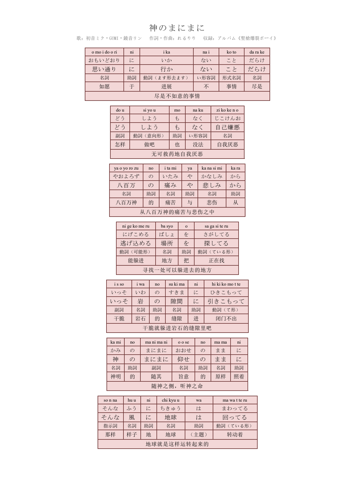

# jp-lyrics-sheet-skill

> 把一首日文歌，做成一页逐词分解表：**罗马音 / 假名 / 写法 / 语法 / 词义 / 整句翻译** 六行并排，一眼看全。



> **特别致谢：本 skill 的原始作者是 YJY。**
> 这套「逐词六行分解表」的样式基准、字段设计与工作流思路都源自 YJY 的原始作品。
> 本仓库是在其基础上做整理、修复与工具链补齐而来——如果这套东西帮到了你，请记得这份功劳首先属于 YJY。

---

## 这是什么

一个把**日文歌词**加工成**逐词标注表**的小工具链：输入一份 JSON 歌词数据，输出**可直接打印的 A4 表格**（HTML + PDF）。适合做歌词笔记、语法拆解、翻译对照、语言学习资料。

- 纯本地运行，不依赖任何在线模板或第三方渲染服务
- 数据驱动：歌词数据、配色、术语分开维护，换一首歌只改数据
- 样式完全固化在 `scripts/gen_sheet.py` 的 CSS 常量里，改一处全局生效

## 特性

| 能力 | 说明 |
| --- | --- |
| **六行逐词表格** | 每句一组表格，逐词一列：罗马音 → 假名 → 写法 → 语法 → 词义 → 整句翻译 |
| **页首标题区** | 成品开头固定为**居中曲名** + 其下**小字居中的信息栏**（作詞 / 作曲 / 編曲 / 歌 / Center / 収録） |
| **罗马音引擎** | 内置假名→罗马音转换，处理促音、长音、拗音、助词 `は/へ/を`；支持 `spec` 与 `hepburn` 双方案 |
| **角色配色** | 独唱 / 合唱分色，填充与边框由代表色按 HSL 自动推导；代表色注册表可积累复用 |
| **打印友好** | A4 竖版、`page-break-inside: avoid`、`print-color-adjust: exact`，粉底不会丢 |
| **零手工依赖** | 自带环境自检、清理、脱敏、打包四个辅助脚本 |

## 效果预览

导出的 PDF 为 A4 竖版，正文结构是：

```
        ┌──────────────────────────────┐
        │        神のまにまに            │   ← 居中曲名（MS Mincho 19px）
        │ 歌：…  作詞・作曲：…  収録：…   │   ← 小字居中信息栏（宋体 10.5px）
        └──────────────────────────────┘
   ┌────┬────┬────┬────┬────┐
   │o   │mo  │i   │do  │... │   ← 罗马音
   │おも│い  │ど  │おり│... │   ← 假名
   │思い│い  │通  │り  │... │   ← 写法（歌词原文）
   │名詞│助詞│名詞│名詞│... │   ← 语法标注
   │如愿│于  │进展│不  │... │   ← 词义
   ├────┴────┴────┴────┴────┤
   │      尽是不如意的事情       │   ← 整句翻译
   └─────────────────────────┘
```

配色版（多角色分色）示例见 `assets/sample_mix_shake.json`（《Mix shake!!》全曲 46 句）。

## 快速开始

### 环境要求

- **Windows**（表格样式依赖 Windows 自带字体：MS Mincho / 宋体 / Times New Roman）
- **Chrome 或 Edge**（用于 HTML → PDF 无头打印；装了 Playwright 的 chromium 也可作兜底）
- **Python 3.8+**，需要 `pypdfium2`、`Pillow`（可选 `playwright`）

```bash
pip install pypdfium2 Pillow
# 可选，作为 PDF 导出的兜底方案
pip install playwright && playwright install chromium
```

### 安装

```bash
# 方式一：直接克隆本仓库
git clone https://github.com/Takenforgranted/jp-lyrics-sheet-skill.git

# 方式二：把仓库目录整个放进你的 skill 目录（也可以放在任意位置直接调用脚本）
#   ~/.workbuddy/skills/jp-lyrics-sheet/
```

### 自检（新机器第一次必跑）

```bash
python scripts/doctor.py --smoke
```

结论 `PASS` 即环境就绪——会依次检查 Python、依赖模块、浏览器、字体、罗马音规则、页首标题区，最后跑一遍端到端样例（HTML + PDF）。

## 使用方法

```bash
# 1. 写数据（见下方「数据格式」），先体检一下
python scripts/gen_sheet.py --data song.json --check

# 2. 生成 HTML
python scripts/gen_sheet.py --data song.json --out song.html

# 3. 转 PDF（同目录产出 song.pdf + 前 3 页预览 PNG，用于目检）
python scripts/build.py song.html

# 4. 看一眼预览 PNG，确认字体/断行/配色/标题区无误后交付
```

### 常用参数

| 命令 | 作用 |
| --- | --- |
| `gen_sheet.py --data x.json --out x.html` | 生成 HTML |
| `gen_sheet.py --data x.json --legend` | 顶部渲染角色配色图例（配色版必加） |
| `gen_sheet.py --data x.json --check` | 只做数据体检，不产出文件 |
| `gen_sheet.py --data x.json --palettes` | 打印本曲所有配色的 base/fill/border 推导结果 |
| `gen_sheet.py --data x.json --labels` | 显示段落标签（Aメロ / サビ …），默认不显示 |
| `gen_sheet.py --data x.json --no-title` | 不输出页首标题区（**仅用于续页/局部片段**） |
| `gen_sheet.py --data x.json --scheme hepburn` | 切换罗马音方案 |
| `build.py x.html --pages 3` | 指定预览页数 |
| `build.py --browser` | 只打印探测到的浏览器 |

## 数据格式

```json
{
  "title": "Mix shake!!",
  "meta": {
    "歌": "スリーズブーケ（日野下花帆・乙宗梢）",
    "作詞": "ケリー",
    "作曲・編曲": "川崎智哉",
    "収録": "1st シングル《Reflection in the mirror》"
  },
  "scheme": "spec",
  "palette": {
    "花帆": { "color": "#f8b500", "label": "日野下花帆" },
    "合唱": { "color": "#da645f", "label": "スリーズブーケ（合唱）" }
  },
  "blocks": [
    {
      "id": "サビ",
      "singer": "合唱",
      "lines": [
        {
          "singer": "花帆",
          "words": [
            { "kana": "おもいどおり", "kanji": "思い通り", "grammar": "名詞", "gloss": "如愿" }
          ],
          "trans": "尽是不如意的事情"
        }
      ]
    },
    { "ref": "サビ" }
  ]
}
```

| 字段 | 必填 | 说明 |
| --- | --- | --- |
| `title` | ✅ | 页首居中显示的曲名（**只放曲名**，别塞歌手等信息） |
| `meta` | ✅ | 曲名下方小字信息栏，dict 保序，键序即显示顺序，渲染成「键：值」 |
| `scheme` | | `spec`（默认，し=si）/ `hepburn`（し=shi） |
| `palette` | | 角色配色表，同名条目会覆盖 `references/colors.md` 里的注册表 |
| `blocks[].id` | | 段落 id，供 `{"ref": "..."}` 引用（重复副歌只需维护一份） |
| `blocks[].singer` | | 块级配色，可被行级 `singer` 覆盖 |
| `lines[].words[].kana` | ✅ | 假名行（全平假名；外来语/英文唱词写片假名读法） |
| `lines[].words[].kanji` | | 写法行（歌词原文，含汉字），默认等于 `kana` |
| `lines[].words[].grammar` | | 语法标注（中文术语，见 `references/grammar_terms.md`） |
| `lines[].words[].gloss` | | 词义，建议 2–6 字 |
| `lines[].words[].romaji` | | 手写罗马音；一般**不填**，由 `romaji.py` 自动生成 |
| `lines[].trans` | | 整句翻译（合并单元格） |

> **页首标题区是硬要求**：成品 HTML / PDF 的开头必须先是标题区（居中曲名 + 小字信息栏），再接表格。`--check` 会在缺 `title` / `meta` 时提示，`doctor.py --smoke` 会断言产物首屏确实含 `jp-title` / `jp-meta`。

## 罗马音方案

默认 `spec` 方案（与参考成品一致）：

| 假名 | spec（默认） | hepburn |
| --- | --- | --- |
| し / ふ / じ | si / hu / zi | shi / fu / ji |
| しゃ / じゃ | sya / zya | sha / ja |
| ち / つ | chi / tsu | chi / tsu |

其余规则：

- 逐假名空格分隔：`おもいどおり` → `o mo i do o ri`
- 促音双写后继辅音：`いっそ` → `i s so`，`きっと` → `ki t to`
- 长音符「ー」并入前一假名：`ラブレター` → `ra bu re ta-`
- 但 **`どう` 是 ど + う → `do u`**，不是 `do-`
- 助词单独成栏时：`は` → `wa`、`へ` → `e`、`を` → `o`

改规则后请跑回归：`python tests/test_romaji.py`（33 条用例）。

## 角色配色

- 代表色注册表在 `references/colors.md`，`gen_sheet.py` 会自动加载；数据里写 `"singer": "日野下花帆"` 即可命中
- 也可在数据里临时用 `palette` 覆盖
- 色值推导（HSL）：**填充** = 同色相、同饱和、亮度 90%；**边框** = 同色相、亮度 32%（饱和上限 0.85）
- 未指定 `singer` 时用参考版固定粉（填充 `#f3d7d7` / 边框 `#6e3636`）
- 指定层级：块级 `singer` → 行级 `singer` 覆盖块级 → 都没有则默认粉
- 做新歌时凡核实过的代表色，建议登记回 `references/colors.md`，下次直接复用

## 目录结构

```
jp-lyrics-sheet/
├── SKILL.md                     Skill 说明（给智能体看的完整工作流）
├── README.md                    本文件
├── scripts/
│   ├── romaji.py                假名 → 罗马音引擎（spec / hepburn 双方案）
│   ├── gen_sheet.py             JSON → HTML 渲染器（含页首标题区，样式都在 CSS 常量里）
│   ├── build.py                 HTML → PDF（浏览器自动探测）+ 渲 PNG 目检
│   ├── doctor.py                环境自检（--smoke 跑端到端）
│   ├── cleanup.py               收尾清理中间文件（默认 dry-run）
│   ├── desensitize.py           打包前脱敏自查（只扫描不改文件）
│   └── pack.py                  打包 zip（--verify 顺带跑解压副本自检）
├── references/
│   ├── grammar_terms.md         语法术语表（--check 拿它校验数据）
│   └── colors.md                角色 / 团队代表色注册表（自动加载、可积累）
├── assets/
│   ├── sample_kaminomanimani.json   样例数据（Aメロ + サビ 7 句，可直接跑）
│   ├── sample_mix_shake.json        角色配色完整示例（全曲 46 句）
│   └── reference/                   参考成品 PDF / PNG
└── tests/
    └── test_romaji.py           罗马音规则回归测试
```

## 工具链速查

| 脚本 | 用途 |
| --- | --- |
| `doctor.py [--smoke]` | 环境 + 规则自检；`--smoke` 追加端到端样例并断言页首标题区 |
| `cleanup.py --work-dir . [--apply]` | 清理工作区中间产物，**默认 dry-run**，白名单模式，保守优先 |
| `desensitize.py [--binaries]` | 打包前扫个人敏感信息（用户名路径 / 密钥 / 邮箱 / 主机名…），只扫描不改文件 |
| `pack.py --out x.zip [--verify]` | 平铺打 zip；`--verify` 解压到临时目录跑三项自检 |

`cleanup.py` 常用姿势：

```bash
python scripts/cleanup.py --work-dir . --keep out.pdf,out.html            # 预览清单
python scripts/cleanup.py --work-dir . --keep out.pdf,out.html --apply    # 确认后真删
python scripts/cleanup.py --apply --temp --skill                          # 连 %TEMP%/jpsheet_* 与内部缓存一起清
```

## 常见问题与踩坑

- **Chrome 报 `0x7B 文件名、目录名或卷标语法不正确`**：`--print-to-pdf` 的值在 subprocess 列表传参时**不能带引号**，引号会被当成文件名的一部分。
- **PDF 里粉底丢了**：确认 CSS 里的 `print-color-adjust: exact` 还在；Playwright 兜底路径已设 `print_background=True`。
- **中文/日文乱码**：Windows PowerShell 管道传日文易乱码，一律先用文件保存 `.py` / `.json` 再执行，调 Python 时加 `-X utf8`。
- **找不到浏览器**：`build.py` 按 Chrome → Edge → Playwright chromium 顺序自动探测；`build.py --browser` 可单独查看探测结果。
- **术语被 `--check` 提示**：`--check` 只提示不阻断；把新术语补进 `references/grammar_terms.md` 即可。
- **本机 `Compress-Archive` 打 zip 失败（exit 1 且无输出）**：改用 `pack.py`（Python `zipfile`），已在脚本里验证过。

## 脱敏约定

分享 / 打包本 skill 前，任何**个人敏感信息**都不许写死真值：

| 类别 | 写法 |
| --- | --- |
| 用户主目录 | `$env:USERPROFILE\...` / `%USERPROFILE%\...`，**不写** `C:\Users\<真实用户名>\` |
| 本机专用盘符路径 | 用 `%LOCALAPPDATA%` 等环境变量；输出目录写 `<OUT_DIR>` / `<WORK_DIR>` |
| Python 解释器 | `$env:USERPROFILE\.workbuddy\...\python.exe`（相对主目录，不含用户名） |
| API key / token / 密码 | 一律 `<API_KEY>` / `<TOKEN>`，**绝不入库** |
| 主机名 / 账户名 / 邮箱 / QQ | 一律 `<HOST>` / `<USER>` / `<EMAIL>` |
| 浏览器、字体等系统路径 | 保留（`C:\Program Files\...`、`C:\Windows\Fonts\...` 非个人隐私） |

打包前自查（输出 `CLEAN` 才能发布）：

```bash
python scripts/desensitize.py --binaries
```

打包：

```bash
python scripts/pack.py --out jp-lyrics-sheet.zip --verify
```

## 致谢 / Credits

- **YJY** —— **本 skill 的原始作者**。「逐词六行分解表」的样式基准（粉底表格、六行字段排布）、JSON 数据结构和最初的工作流都出自 YJY 之手。本仓库在其原作基础上进行了整理、修复与工具链补齐（浏览器自动探测、页首标题区固化、角色配色、`doctor` / `cleanup` / `desensitize` / `pack` 工具链）。**感谢 YJY 的原始创作**，这套东西的起点是他的工作。
- 样式参照曲目：**《神のまにまに》**（作詞・作曲：れるりり）。
- 角色代表色的核实方法参考**萌娘百科**歌曲页 / 角色页的歌词配色图例。

## 免责声明

本项目用于**个人学习与歌词笔记**。示例歌词及其相关著作权归各自权利人所有；请勿将本项目产出的内容用于任何商业用途，也不要将整首歌词公开传播。工具本身只负责排版，不提供歌词数据。

## 许可

仓库暂未声明开源许可证。如需在项目中复用，请先联系作者确认；同时请一并尊重 YJY 对原始作品的权利。
